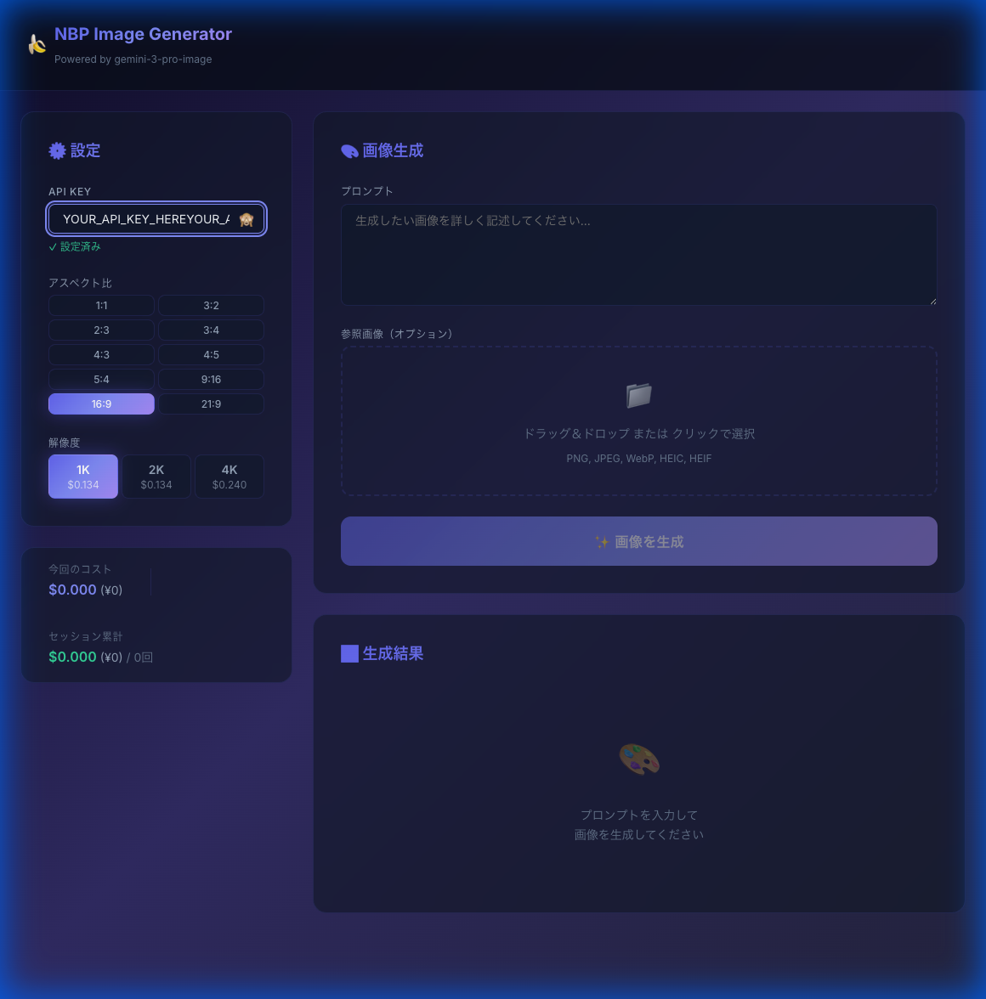
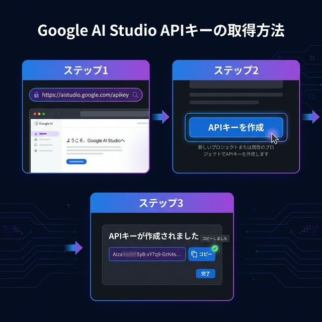
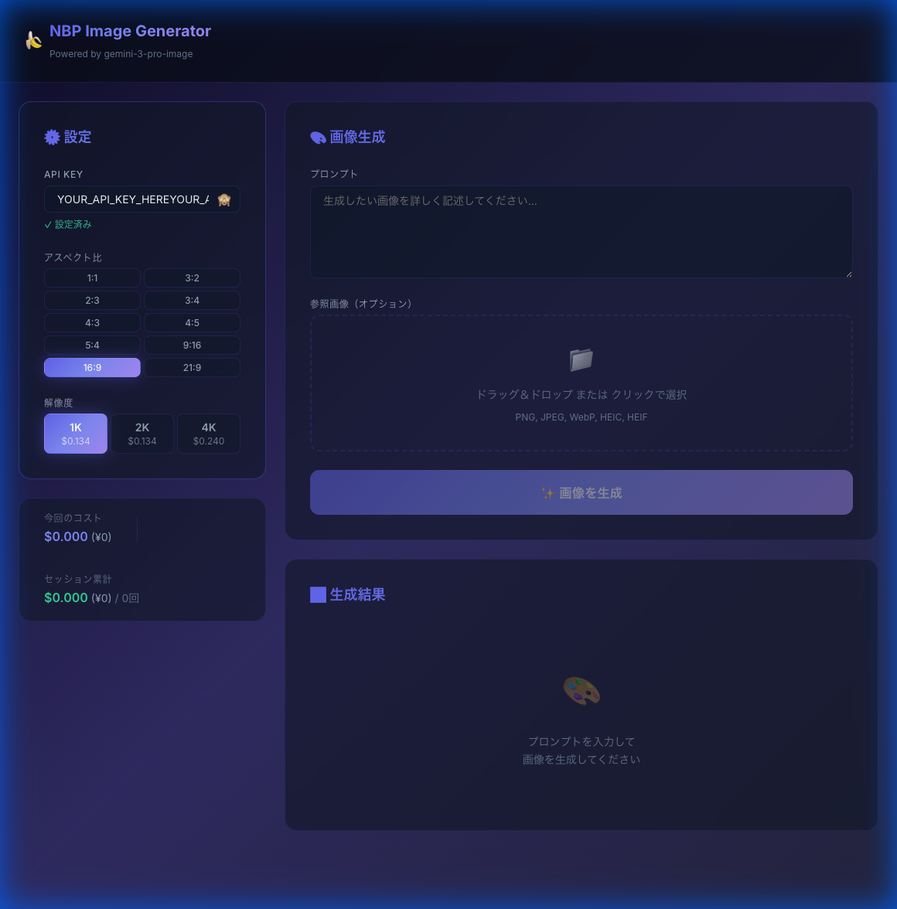

# 🍌 NBP Image Generator

**Nano Banana Pro（gemini-3-pro-image）を使った画像生成Webアプリ**

Google の最新画像生成AI「Gemini 3 Pro Image」を、ブラウザから簡単に使えるツールです。



---

## 🚀 デモサイト

**👉 [https://seiseiai1st.github.io/NanoBananaProPlayGround/](https://seiseiai1st.github.io/NanoBananaProPlayGround/)**

> ブラウザだけで使えます。インストール不要です。

---

## 📋 できること

| 機能 | 説明 |
|---|---|
| 🖼️ テキストから画像生成 | プロンプトを入力して画像を生成 |
| 📐 アスペクト比の選択 | 1:1 / 3:2 / 2:3 / 3:4 / 4:3 / 4:5 / 5:4 / 9:16 / 16:9 / 21:9 の10種類 |
| 🔍 解像度の選択 | 1K / 2K / 4K から選択可能 |
| 🖼️ 参照画像のアップロード | 画像をドラッグ&ドロップで参照画像として送信 |
| 💾 画像の保存 | 生成された画像をPNGファイルとしてダウンロード |
| 💰 コスト表示 | 1回あたりの料金とセッション累計をUSD/JPYで表示 |
| 📜 履歴表示 | 直近20枚の生成履歴をサムネイルで表示 |

---

## 🔑 はじめに — API Key の取得方法

このアプリを使うには、Google の **API Key** が必要です（無料で取得できます）。



### ステップ 1: Google AI Studio を開く

以下のリンクにアクセスしてください：

**👉 [https://aistudio.google.com/apikey](https://aistudio.google.com/apikey)**

> Googleアカウントでログインが必要です。

### ステップ 2: API Key を作成

1. ページ内の **「APIキーを作成」** ボタンをクリック
2. プロジェクトを選択（既存のプロジェクト、または新しいプロジェクトを作成）
3. API Key が生成されます

### ステップ 3: API Key をコピー

- 表示された `AIza...` で始まる文字列をコピーしてください
- このキーをアプリの **「API KEY」** 欄に貼り付けます

> ⚠️ **注意:** API Key は他人に共有しないでください。あなた専用のキーです。

---

## 📖 使い方

### 1. API Key を設定する



画面左側の **「設定」** パネルで：
1. **API KEY** 欄に、取得した API Key を貼り付けます
2. ✅ 「設定済み」 と表示されれば OK です
3. キーはブラウザに保存されるため、次回以降は入力不要です

### 2. 生成設定を選ぶ

同じ設定パネルで：
- **アスペクト比** — 生成する画像の縦横比を選択（デフォルト: 16:9）
- **解像度** — 1K / 2K / 4K から選択（高解像度ほど料金が高くなります）

### 3. プロンプトを入力する

画面右側の **「プロンプト」** 欄に、生成したい画像の説明を入力します。

**入力例：**
```
美しい夕焼けの富士山、雲海の上から撮影した風景写真
```

```
カフェラテのラテアート、ハートの模様、木のテーブルの上、
自然光で撮影された写真風
```

> 💡 **ヒント:** 具体的に詳しく書くほど、イメージ通りの画像が生成されます。

### 4. 参照画像を追加する（オプション）

元にしたい画像がある場合：
1. **「参照画像（オプション）」** エリアに画像をドラッグ＆ドロップ
2. または、クリックしてファイルを選択
3. 対応形式: PNG, JPEG, WebP, HEIC, HEIF

### 5. 画像を生成する

- **「✨ 画像を生成」** ボタンをクリック
- または **⌘ + Enter**（ Mac）/ **Ctrl + Enter**（Windows）で生成

生成には数秒〜十数秒かかります。

### 6. 画像を保存する

- 生成された画像の下にある **「💾 保存」** ボタンをクリック
- PNG ファイルとしてダウンロードされます

---

## 💰 料金について

このアプリ自体は **無料** ですが、画像生成には Google API の料金がかかります。

| 解像度 | 1枚あたりの料金 |
|---|---|
| 1K | $0.034（約¥5） |
| 2K | $0.034（約¥5） |
| 4K | $0.240（約¥36） |

> 参照画像を使用した場合、追加で $0.001/枚 かかります。
> 
> 最新の料金は [Google AI の公式ページ](https://ai.google.dev/pricing) をご確認ください。

---

## 🔒 セキュリティについて

- API Key は **あなたのブラウザ内（localStorage）にのみ保存**されます
- サーバーを経由せず、**ブラウザから Google API に直接通信**します
- 他のユーザーや開発者が API Key にアクセスすることはできません

---

## 🛠️ 開発者向け情報

### ローカルで実行

```bash
git clone https://github.com/seiseiai1st/NanoBananaProPlayGround.git
cd NanoBananaProPlayGround
npm install
npm run dev
```

### 技術スタック

- **フレームワーク:** Vite + React 19 + TypeScript
- **スタイリング:** Vanilla CSS（ダークテーマ、Glassmorphism）
- **API:** Google Gemini 3 Pro Image（generateContent エンドポイント）
- **ホスティング:** GitHub Pages（GitHub Actions 自動デプロイ）

---

## 📝 ライセンス

MIT License
